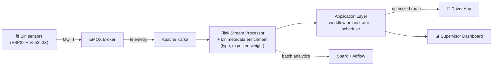
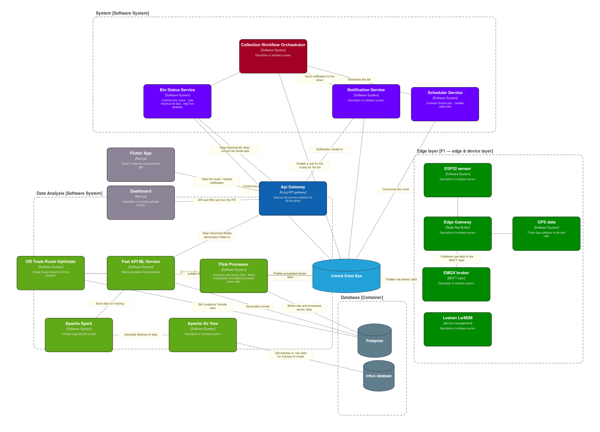

Claude finished the response

Ran 5 commands, edited a file, read a file · 2 notes
Ran 5 commands, edited a file, read a file · 2 notes
Done — UAE fashion marketplace swapped out for Estate ERP with both repo links.

Hiruna malavipathirana keells qa cv
Document · PDF 

Hiruna malavipathirana keells qa cv
TEX 
https://github.com/UOM-CSE-Sem4-GroupF  go through the repositories of this organization , and create a .readme for the organization .   This is a smart waste management system ,  it collects bin levels through edge devices and thorugh mqtt broker put them to the kafka bus , then in the data layer through flink processor they are processed and meta data is added along with bin types , expected weight . then the applicaiton layer subs to the data from the the data layer , then automatically scheudules lorries to collect the garbage from the bins. a supervisor can monitor this through the dashboard

Searched the web, ran a command
Searched the web, ran a command
Found all 8 repos in the org, including a .github repo — that's exactly where an org profile README needs to live. Let me look at the ones I haven't examined yet before writing this.

Ran 4 commands, searched the web, created a file · 1 note
Ran 4 commands, searched the web, created a file · 1 note
A few notes on what I did:

To make this render on the org's profile page, this content needs to go into the existing .github repo, at the path profile/README.md. That repo already exists in your org — you just need to add/replace that file.
The architecture diagram is Mermaid, which GitHub renders natively as an actual flowchart on the page — not a static image, so it stays crisp and it's easy to edit later.
I went through all 8 repos, not just the 3 I'd looked at before — this surfaced two I hadn't seen: the IOT repo (actual ESP32 firmware using dual VL53L0X time-of-flight sensors with adaptive sleep cycles based on fill level — genuinely nice battery-conscious edge design) and the Mobile-App repo, which turned out to be the driver-facing Flutter app (waste_collect_driver), not a citizen-facing app. The Edge and Vehicle-Simulator repos were also new to me — Edge specifically owns the Mosquitto → Node-RED → EMQX → Kafka integration path with its own observability stack.
I added an F5 line to the team structure (Observability & QA) based on the Edge repo's README mentioning "Person 5 observability/CI work" — flag this if that's not an accurate grouping, since I inferred it from one repo's README rather than a document that names the team split explicitly the way the F4 task list did.

Uom cse sem4 groupf org readme
Document · MD 

Group F Wst Mngmt.drawio
drawio

can you add this architecure diagram to the readme as well

Ran a command
Ran a command
This is a real C4-model architecture diagram in draw.io's XML format — GitHub can't render .drawio files inline, so I'll need to convert it to an image first. Let me look at the full structure.

Ran 7 commands, viewed a file · 2 notes

Ran 7 commands, viewed a file · 2 notes
Very faithful reproduction — all four boundary groups, every node, every labeled connection. Let me fix a few obvious typos from the original diagram before finalizing (sesnor→sensor, Comsumes→Consumes, etc.) since this is going into a public-facing README:

Ran 3 commands, viewed a file, edited a file · 2 notes

Ran 3 commands, viewed a file, edited a file · 2 notes
Here's what I did, since .drawio files don't render on GitHub:

Parsed your actual .drawio XML programmatically rather than eyeballing it — pulled every node's exact position, color, and C4 metadata (name/type/technology/description), and every edge's source, target, and label directly from the file. That's 24 components and 26 labeled connections, all traced automatically rather than transcribed by hand, so nothing got mis-copied.
Rendered it as SVG + PNG matching your original layout, colors, and grouping (System / Data Analysis / Edge layer / Database boundaries all preserved).
Fixed a handful of typos from the original diagram (sesnor→sensor, Comsumes→Consumes, Databse→Database) since this is now public-facing.
Embedded the PNG in the README and included the SVG as an editable source file — both need to sit alongside README.md in the .github/profile/ folder for the image path to resolve.
One thing worth flagging: a few connector labels sit close together where the original diagram was dense (near the API Gateway and Central Event Bus) — still fully readable, but if you want tighter spacing there, the SVG is easy to hand-edit since it's plain text, not a binary format.

Uom cse sem4 groupf org readme
Document · MD 

Uom cse sem4 groupf architecture
Image · PNG 

Uom cse sem4 groupf architecture
Image · SVG 

Claude is AI and can make mistakes. Please double-check responses.

Uom cse sem4 groupf org readme · MD
# ♻️ Smart Waste Management System
 
A distributed, real-time platform that turns ordinary street bins into a self-scheduling waste collection network — built as our Semester 4 Software Engineering project at the **Department of Computer Science & Engineering, University of Moratuwa**.
 
Bins report their own fill level from the edge. The platform decides, on its own, which bins are worth a truck trip today, builds an optimized route, and hands it to a driver — while a supervisor watches the whole city on a live dashboard.
 
---
 
## How it works
 

 
1. **Edge sensors** on each bin measure fill level with dual time-of-flight sensors and publish MQTT telemetry — sleeping longer when a bin is empty and waking more often as it fills, to save battery.
2. Telemetry flows through an **EMQX broker onto an Apache Kafka bus**, the backbone connecting every subsystem below.
3. A **Flink stream processor** consumes that bus in real time, enriching each reading with bin metadata (type, expected weight) before anything downstream sees it. Apache Spark and Airflow handle the batch/analytics side of the same data.
4. The **application layer** subscribes to the processed stream, decides which bins need a collection, and an OR-Tools-powered scheduler builds an optimized route — automatically, with no manual dispatch.
5. The route reaches a **driver through a mobile app**, while a **supervisor watches the entire operation live on a web dashboard**.
### Full System Architecture
 

*Full component-level view — every service, message topic, and data store, with each connection labeled. Editable source: [`architecture.svg`](./architecture.svg).*
 
---
 
## Repositories
 
| Repo | What it is |
|---|---|
| [**Smart-Waste-Management-System-IOT**](https://github.com/UOM-CSE-Sem4-GroupF/Smart-Waste-Management-System-IOT) | Bin-level edge firmware — ESP32 + dual VL53L0X sensors, adaptive publish/sleep cycles, MQTT telemetry. |
| [**Smart-Waste-Management-System-Edge**](https://github.com/UOM-CSE-Sem4-GroupF/Smart-Waste-Management-System-Edge) | The edge integration path — Mosquitto → Node-RED gateway → EMQX → Kafka — with an observability stack (Prometheus/Grafana) and a hardware/simulator dual-mode setup. |
| [**Smart-Waste-Management-System-DataAnalysis**](https://github.com/UOM-CSE-Sem4-GroupF/Smart-Waste-Management-System-DataAnalysis) | The data layer: Flink real-time processing, route optimization (Google OR-Tools), ML inference APIs, and Spark/Airflow batch pipelines. |
| [**Smart-Waste-Management-System-Application**](https://github.com/UOM-CSE-Sem4-GroupF/Smart-Waste-Management-System-Application) | The application layer — bin-status service, workflow orchestrator, scheduler, notifications, and the supervisor dashboard (Next.js). |
| [**Smart-Waste-Management-System-Mobile-App**](https://github.com/UOM-CSE-Sem4-GroupF/Smart-Waste-Management-System-Mobile-App) | Flutter driver app for receiving and executing collection routes. |
| [**Smart-Waste-Management-System-Vehicle-Simulator**](https://github.com/UOM-CSE-Sem4-GroupF/Smart-Waste-Management-System-Vehicle-Simulator) | Simulates collection vehicles and routes so the full pipeline can be tested end-to-end without physical trucks. |
| [**Smart-Waste-Management-System-Platform**](https://github.com/UOM-CSE-Sem4-GroupF/Smart-Waste-Management-System-Platform) | Platform, security, and infrastructure — Kubernetes (DOKS), Kong API Gateway, Istio service mesh, Keycloak IAM, Terraform/ArgoCD, and Hyperledger blockchain integration. |
 
---
 
## Tech Stack
 
**Edge & IoT** — ESP32, VL53L0X ToF sensors, PlatformIO, MQTT, EMQX, Node-RED
**Streaming & Data** — Apache Kafka, Apache Flink, Apache Spark, Apache Airflow, Google OR-Tools
**Application** — Fastify, FastAPI, Next.js, PostgreSQL
**Mobile** — Flutter
**Platform & Infra** — Kubernetes (DigitalOcean), Terraform, ArgoCD, Kong, Istio, Keycloak, Hyperledger, Prometheus, Grafana
 
---
 
## Team Structure
 
The system is split across five functional areas (F1–F5), each owning an independent repo with its own deployment lifecycle, integrated end-to-end over Kafka:
 
- **F1 — Edge & IoT:** sensor firmware and the edge-to-broker integration path
- **F2 — Data & Intelligence:** stream/batch processing, enrichment, and route optimization
- **F3 — Application:** orchestration, scheduling, driver/supervisor-facing services
- **F4 — Platform, Security & Integration:** Kubernetes infrastructure, API gateway, identity, and blockchain integration
- **F5 — Observability & QA:** monitoring, CI/CD, and reliability tooling across the stack
---
 
*A Semester 4 Software Engineering group project, Department of Computer Science & Engineering, University of Moratuwa.*
 

