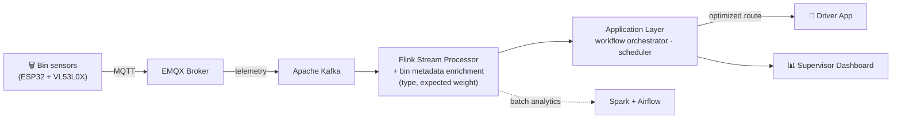

Uom cse sem4 groupf org readme · MD
# ♻️ Smart Waste Management System
 
A distributed, real-time platform that turns ordinary street bins into a self-scheduling waste collection network — built as our Semester 4 Software Engineering project at the **Department of Computer Science & Engineering, University of Moratuwa**.
 
Bins report their own fill level from the edge. The platform decides, on its own, which bins are worth a truck trip today, builds an optimized route, and hands it to a driver — while a supervisor watches the whole city on a live dashboard.
 
---
 
## How it works
 

 
1. **Edge sensors** on each bin measure fill level with dual time-of-flight sensors and publish MQTT telemetry — sleeping longer when a bin is empty and waking more often as it fills, to save battery.
2. Telemetry flows through an **EMQX broker onto an Apache Kafka bus**, the backbone connecting every subsystem below.
3. A **Flink stream processor** consumes that bus in real time, enriching each reading with bin metadata (type, expected weight) before anything downstream sees it. Apache Spark and Airflow handle the batch/analytics side of the same data.
4. The **application layer** subscribes to the processed stream, decides which bins need a collection, and an OR-Tools-powered scheduler builds an optimized route — automatically, with no manual dispatch.
5. The route reaches a **driver through a mobile app**, while a **supervisor watches the entire operation live on a web dashboard**.
### Full System Architecture
 

*Full component-level view — every service, message topic, and data store, with each connection labeled. Editable source: [`architecture.svg`](./architecture.svg).*
 
---
 
## Repositories
 
| Repo | What it is |
|---|---|
| [**Smart-Waste-Management-System-IOT**](https://github.com/UOM-CSE-Sem4-GroupF/Smart-Waste-Management-System-IOT) | Bin-level edge firmware — ESP32 + dual VL53L0X sensors, adaptive publish/sleep cycles, MQTT telemetry. |
| [**Smart-Waste-Management-System-Edge**](https://github.com/UOM-CSE-Sem4-GroupF/Smart-Waste-Management-System-Edge) | The edge integration path — Mosquitto → Node-RED gateway → EMQX → Kafka — with an observability stack (Prometheus/Grafana) and a hardware/simulator dual-mode setup. |
| [**Smart-Waste-Management-System-DataAnalysis**](https://github.com/UOM-CSE-Sem4-GroupF/Smart-Waste-Management-System-DataAnalysis) | The data layer: Flink real-time processing, route optimization (Google OR-Tools), ML inference APIs, and Spark/Airflow batch pipelines. |
| [**Smart-Waste-Management-System-Application**](https://github.com/UOM-CSE-Sem4-GroupF/Smart-Waste-Management-System-Application) | The application layer — bin-status service, workflow orchestrator, scheduler, notifications, and the supervisor dashboard (Next.js). |
| [**Smart-Waste-Management-System-Mobile-App**](https://github.com/UOM-CSE-Sem4-GroupF/Smart-Waste-Management-System-Mobile-App) | Flutter driver app for receiving and executing collection routes. |
| [**Smart-Waste-Management-System-Vehicle-Simulator**](https://github.com/UOM-CSE-Sem4-GroupF/Smart-Waste-Management-System-Vehicle-Simulator) | Simulates collection vehicles and routes so the full pipeline can be tested end-to-end without physical trucks. |
| [**Smart-Waste-Management-System-Platform**](https://github.com/UOM-CSE-Sem4-GroupF/Smart-Waste-Management-System-Platform) | Platform, security, and infrastructure — Kubernetes (DOKS), Kong API Gateway, Istio service mesh, Keycloak IAM, Terraform/ArgoCD, and Hyperledger blockchain integration. |
 
---
 
## Tech Stack
 
**Edge & IoT** — ESP32, VL53L0X ToF sensors, PlatformIO, MQTT, EMQX, Node-RED
**Streaming & Data** — Apache Kafka, Apache Flink, Apache Spark, Apache Airflow, Google OR-Tools
**Application** — Fastify, FastAPI, Next.js, PostgreSQL
**Mobile** — Flutter
**Platform & Infra** — Kubernetes (DigitalOcean), Terraform, ArgoCD, Kong, Istio, Keycloak, Hyperledger, Prometheus, Grafana
 
---
 
## Team Structure
 
The system is split across five functional areas (F1–F5), each owning an independent repo with its own deployment lifecycle, integrated end-to-end over Kafka:
 
- **F1 — Edge & IoT:** sensor firmware and the edge-to-broker integration path
- **F2 — Data & Intelligence:** stream/batch processing, enrichment, and route optimization
- **F3 — Application:** orchestration, scheduling, driver/supervisor-facing services
- **F4 — Platform, Security & Integration:** Kubernetes infrastructure, API gateway, identity, and blockchain integration
- **F5 — Observability & QA:** monitoring, CI/CD, and reliability tooling across the stack
---
 
*A Semester 4 Software Engineering group project, Department of Computer Science & Engineering, University of Moratuwa.*
 

